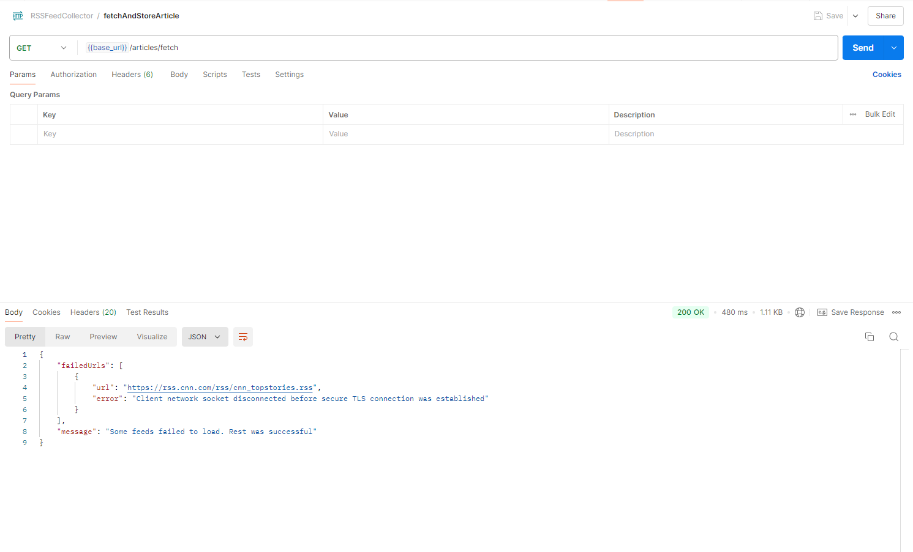
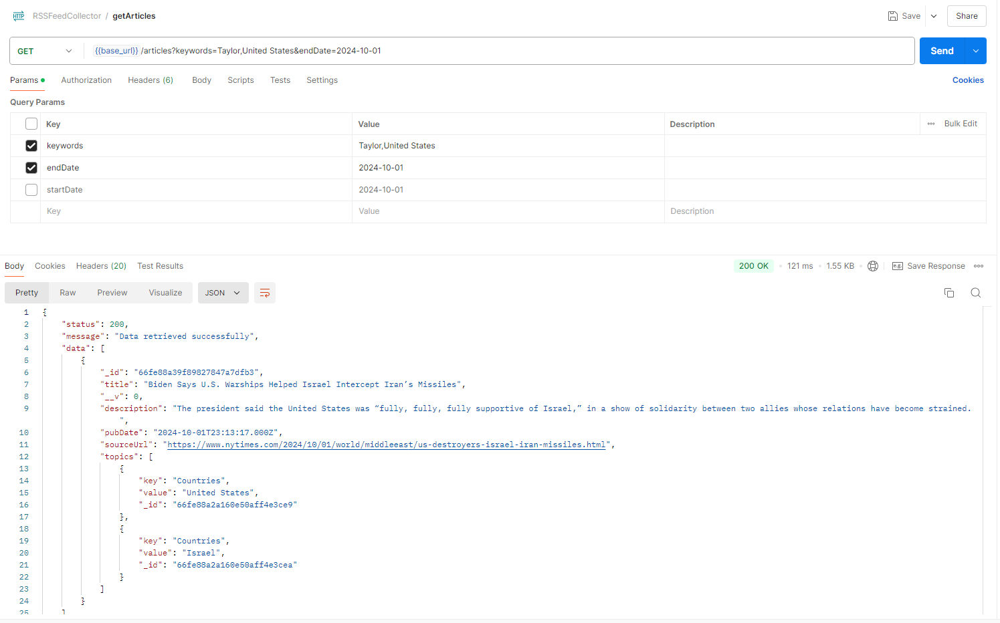

# News Aggregator

## Overview

This News Aggregator was created to collect news articles from various RSS feeds, extracts topics, and stores them in a MongoDB database. It allows for periodic fetching of news articles, ensuring users always have the latest information.

## Features

- **Fetch Articles**: Collects news articles from configurable RSS feed URLs.
- **Persist Data**: Stores articles in a MongoDB database with relevant fields.
- **Topic Extraction**: Extracts keywords/topics from article content for better categorization.
- **Scheduled Fetching**: Uses cron jobs to periodically fetch and update news articles.
- **Filtering**: Allows filtering of articles based on keywords or publication date.
- **Named Entity Recognition**: Identifies and stores named entities (people, locations, organizations) in articles.

## Technologies Used

- **Node.js**: JavaScript runtime for server-side development.
- **Express**: Web framework for Node.js.
- **MongoDB**: NoSQL database for storing articles.
- **RSS Parser**: Library for parsing RSS feeds.
- **Cron**: Library for scheduling tasks.

## Prerequisites

- **Node.js**: Ensure you have Node.js installed (v14 or higher).
- **MongoDB**: You need a MongoDB database running locally or use a cloud service (e.g., MongoDB Atlas). Update the DATABASE string in the config.js file under ./app/configs/ directory

## Installation Steps

1. **Clone the Repository**:
   ```bash
   git clone https://github.com/FarhanIsrakYen/NewsAggregator.git
2. **Install Dependencies**:
   ```bash
   npm install
3. **Configure Environment Variables and Configs**:
    - Update the NODE_ENV for your required environment in .env file
    - In the config.js file under ./app/configs/ directory, update the RSS_FEEDS based on your requirements

4. **Run MongoDB** (if using a local instance): Ensure that your MongoDB service is running. If installed locally, you can start it with:
   ```bash
   mongod
5. **Start the Server**:
      ```bash
   nodemon index.js
6. **Access the API**:
    - Open postman and import RSSFeedCollector.json file
    - Set the global variable base_url as http://localhost:3000/api
    - Hit the {{base_url}}/articles/fetch or http://localhost:3000/api/articles/fetch to fetch data. If any feed url fails to fetch data, it'll show you that url in response. It'll fetch news from other urls though.
      
    - Hit the {{base_url}}/articles or http://localhost:3000/api/articles and provide keywords like below to get the stored news
      
7. **CronJob**
    - A cronjob was set to fetch news on the first minute of every hour
8. **Error Logs**
    - For handling error, there are two files - error.log and combined.log . error.log file is containing all the errors occurring during operations and combined.log contains all the logs
9. **Topic Extractions**
    - As OpenAPI or AWS Machine Learning or Google ML Services ae paid service, I did it manually by storing the topics in config.js file under ./app/configs/ directory categorizing them. You can check the output for that.


## Contributing

Pull requests are welcome. For major changes, please open an issue first
to discuss what you would like to change.

Please make sure to update tests as appropriate.

## License

[MIT](https://choosealicense.com/licenses/mit/)